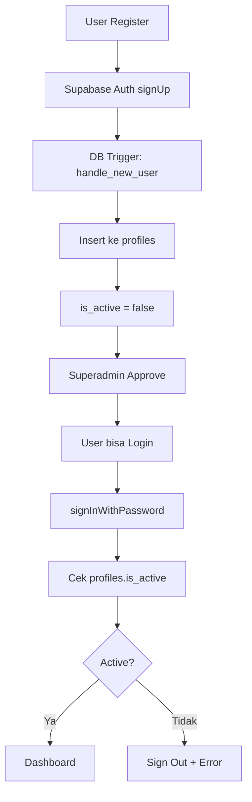

# 💰 Petty Cash — KOPKAR MAJU

Sistem pencatatan kas kecil (petty cash) berbasis web untuk Koperasi Karyawan Maju. Mengelola pemasukan, pengeluaran, stok fisik uang, dan laporan buku besar secara real-time.

---

## 📌 Ringkasan

Dashboard web untuk pencatatan arus kas kecil koperasi. Mendukung input transaksi dengan rincian pecahan uang, manajemen anggota, kategori transaksi, serta fitur persetujuan akun oleh superadmin.

---

## 🏷️ Badge


---

## 🖼️ Preview

```
┌─────────────────────────────────────────┐
│  KOPKAR MAJU          [Arka] [v]        │
├──────────┬──────────────────────────────┤
│ Dashboard│  Saldo Kas    Total Keluar   │
│ Pencatan │  Rp 5.000.000  Rp 2.000.000  │
│ Kas Fisik│                              │
│ Master   │  Pencatatan Terbaru          │
│ Admin    │  ┌──────┬──────┬──────────┐  │
│          │  │ Tgl  │ Nom  │ Ket      │  │
│          │  ├──────┼──────┼──────────┤  │
│          │  │ 03/08│ +50K │ Pinjaman │  │
│          │  └──────┴──────┴──────────┘  │
└──────────┴──────────────────────────────┘
```

> [Tambahkan screenshot asli di sini]

---

## ✨ Fitur Utama

- 🔐 **Autentikasi** — Login & register dengan Supabase Auth
- 👥 **Manajemen Anggota** — CRUD anggota (184 data seed)
- 📂 **Kategori & Sub Kategori** — 6 kategori utama, 19 sub kategori
- 📝 **Pencatatan Kas** — Input pemasukan/pengeluaran dengan rincian pecahan uang
- 💵 **Kas Fisik** — Edit inline jumlah pecahan uang di kas
- 📊 **Buku Besar** — Saldo berjalan otomatis dari semua transaksi
- 👑 **Admin Panel** — Superadmin approve/atur peran akun
- 📥 **Export Excel** — Unduh data transaksi ke file Excel
- 📱 **Responsive** — Tampilan adaptif desktop dan mobile

---

## 🛠️ Tech Stack

| Komponen | Teknologi |
|---|---|
| Framework | Next.js 16 (App Router + Turbopack) |
| UI Library | React 19 |
| Bahasa | TypeScript 5 |
| Styling | Tailwind CSS 4 |
| Icons | Lucide React |
| Database | PostgreSQL (Supabase Cloud) |
| Auth | Supabase Auth + RLS |
| State | Custom store (`useSyncExternalStore`) |
| Export | ExcelJS (dynamic import) |
| Forms | React Hook Form + Zod |

---

## 📁 Struktur Folder

<details>
<summary>📁 Klik untuk lihat struktur folder</summary>

```text
petty-cash/
├── src/
│   ├── app/
│   │   ├── dashboard/
│   │   │   ├── admin/users/page.tsx    # Kelola akun
│   │   │   ├── kas-fisik/page.tsx      # Kas fisik inline edit
│   │   │   ├── list/page.tsx           # Pencatatan kas
│   │   │   ├── master-data/page.tsx    # Anggota, kategori, sub
│   │   │   ├── layout.tsx              # Dashboard layout
│   │   │   └── page.tsx                # Dashboard utama
│   │   ├── login/page.tsx              # Halaman login
│   │   ├── register/page.tsx           # Halaman register
│   │   ├── layout.tsx                  # Root layout
│   │   └── globals.css                 # Global styles
│   ├── components/
│   │   ├── dashboard/stat-card.tsx
│   │   ├── layout/sidebar.tsx, topbar.tsx, dashboard-shell.tsx
│   │   ├── shared/combobox, stock-input, attachment-input, dll
│   │   └── ui/button, card, dialog, input, table, dll
│   ├── lib/
│   │   ├── store.ts                    # Global state + Supabase queries
│   │   ├── cash-math.ts                # Kalkulasi pecahan uang
│   │   ├── export-excel.ts             # Export ke Excel
│   │   └── utils.ts                    # Helper functions
│   ├── types/index.ts                  # TypeScript interfaces
│   └── utils/supabase/                 # Supabase client factories
├── supabase/schema.sql                 # Database schema + seed data
├── package.json
└── README.md
```

</details>

---

## 🚀 Cara Instalasi

### Prasyarat

- Node.js 18+
- npm atau yarn
- Akun Supabase (gratis)

### 1. Clone repository

```bash
git clone https://github.com/Zenithrath/Petty-Cash.git
cd Petty-Cash
```

### 2. Install dependency

```bash
npm install
```

### 3. Buat database di Supabase

Buka **Supabase Dashboard → SQL Editor**, jalankan seluruh isi file `supabase/schema.sql`.

### 4. Konfigurasi environment

Buat file `.env.local` di root project:

```env
NEXT_PUBLIC_SUPABASE_URL=https://xxxxx.supabase.co
NEXT_PUBLIC_SUPABASE_PUBLISHABLE_KEY=eyJhbG...
SUPABASE_SERVICE_ROLE_KEY=eyJhbG...
```

> Ambil nilai dari **Supabase Dashboard → Settings → API**

### 5. Bootstrap superadmin

Setelah register akun pertama, jalankan di SQL Editor:

```sql
UPDATE public.profiles
SET role = 'superadmin', is_active = true, approved_at = now()
WHERE email = 'email kamu';
```

---

## ▶️ Cara Menjalankan

**Development:**

```bash
npm run dev
```

Buka http://localhost:3000

**Production:**

```bash
npm run build
npm start
```

---

## 🌐 Daftar Halaman

| Route | Keterangan | Akses |
|---|---|---|
| `/login` | Halaman masuk | Publik |
| `/register` | Halaman daftar | Publik |
| `/dashboard` | Dashboard utama | Login |
| `/dashboard/list` | Pencatatan kas (in/out) | Login |
| `/dashboard/kas-fisik` | Edit kas fisik | Login |
| `/dashboard/master-data` | Kelola anggota & kategori | Login |
| `/dashboard/admin/users` | Kelola akun pengguna | Superadmin |

---

## 🔐 Arsitektur Autentikasi



---

## 📈 Hasil Audit Lighthouse

<details>
<summary>📊 Desktop — /dashboard</summary>

| Kategori | Skor |
|---|---:|
| Performance | 94 |
| Accessibility | 94 |
| Best Practices | 100 |
| SEO | 100 |

</details>

<details>
<summary>📱 Mobile — /dashboard/list</summary>

| Kategori | Skor |
|---|---:|
| Performance | 67 |
| Accessibility | 97 |
| Best Practices | 96 |
| SEO | 100 |

**Catatan:** Performa mobile masih perlu optimasi (JavaScript execution time, TBT).

</details>

---

## ♿ Hasil Audit WAVE

| Item | Hasil |
|---|---:|
| Errors | 0 |
| Contrast Errors | 0 |
| Alerts | 4 |
| AIM Score | 9.9 / 10 |

**Status:** Tidak ditemukan error. Alert yang ada bersifat ringan (heading level, redundant link, small text).

---

## ✅ Testing Manual

- [ ] Login & register berfungsi
- [ ] Navigasi sidebar berjalan baik
- [ ] Pencatatan kas (inflow/outflow) tersimpan
- [ ] Kas fisik bisa diedit inline
- [ ] Master data CRUD berfungsi
- [ ] Admin bisa approve/reject user
- [ ] Export Excel menghasilkan file
- [ ] Tampilan responsive di mobile
- [ ] Tidak ada error di console

---

## 📌 roadmap

- [ ] Optimasi performance mobile
- [ ] Lazy load komponen berat
- [ ] Pagination untuk daftar transaksi
- [ ] Loading skeleton
- [ ] Realtime updates dengan Supabase Realtime
- [ ] Notifikasi untuk superadmin

---

## 👤 Author

**Arka** — [emailarkal@gmail.com](mailto:emailarkal@gmail.com)
GitHub: [@Zenithrath](https://github.com/Zenithrath)

---

## 📄 License

MIT License © 2026
